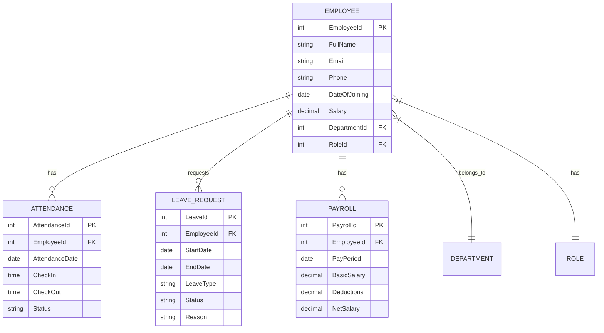

<div align="center">
  <h1>✨ Employee Payroll Management System</h1>
  <p>
    <strong>A modern, full-stack solution for managing employee payroll, attendance, and leave with ease.</strong>
  </p>
  
  [](https://dotnet.microsoft.com/)
  [](https://angular.io/)
  [](https://www.microsoft.com/sql-server/)
  [](https://opensource.org/licenses/MIT)

  <p>
    <a href="#getting-started">Get Started</a> •
    <a href="#features">Features</a> •
    <a href="#tech-stack">Tech Stack</a> •
    <a href="#api-documentation">API Docs</a>
  </p>
</div>

## 🌟 Features

### 👥 Employee Management
- 📝 Add, view, update, and deactivate employee profiles
- 📊 Track employee details, roles, and department assignments
- 🔍 Advanced search and filtering capabilities

### 🕒 Attendance System
- ✅ Mark daily attendance with check-in/check-out
- 📅 View monthly attendance reports
- ⚡ Bulk attendance upload for HR convenience

### 🌴 Leave Management
- 📋 Apply for leave with different leave types
- ✅ Manager approval workflow
- 📊 Track leave balances and history

### 💰 Payroll Processing
- 🧮 Automated salary calculations
- 📄 Generate and download payslips
- 📈 Tax and deduction management

### 🔒 Security & Access
- 🔑 JWT-based authentication
- 🛡️ Role-based access control (Admin, HR, Employee)
- 📜 Comprehensive audit logging

## 🛠️ Technology Stack

### Backend
| Technology | Purpose |
|------------|---------|
| .NET 8 Web API | Robust RESTful API development |
| Entity Framework Core | Modern ORM for database operations |
| Dapper | High-performance data access for complex queries |
| SQL Server | Enterprise-grade database management |
| JWT Authentication | Secure token-based authentication |
| AutoMapper | Clean object-to-object mapping |
| Swagger/OpenAPI | Interactive API documentation |
| xUnit | Unit testing framework |

### Frontend
| Technology | Purpose |
|------------|---------|
| Angular 18 | Modern component-based framework |
| Angular Material | Beautiful UI components following Material Design |
| TypeScript | Type-safe JavaScript development |
| RxJS | Reactive programming for state management |
| SCSS | Powerful CSS preprocessor |
| NgRx (Optional) | State management for larger applications |

## 📁 Project Structure

```
EmployeePayrollAPI/
├── EmployeePayrollAPI/          # Backend .NET Web API
│   ├── Controllers/             # API Controllers
│   ├── Models/                  # Data models and DTOs
│   ├── Repositories/            # Data access layer
│   ├── Services/                # Business logic layer
│   └── Data/                    # Database context and configurations
├── FrontEnd_Employe_Payroll/    # Frontend Angular application
│   └── EmployeePayrollApp/      # Angular project
│       ├── src/
│       │   ├── app/
│       │   │   ├── components/  # Angular components
│       │   │   ├── services/    # Angular services
│       │   │   └── models/      # TypeScript models
│       │   └── environments/    # Environment configurations
└── Database_Schema.sql          # Database schema and seed data
```

## 🚀 Getting Started

### Prerequisites

Before you begin, ensure you have the following installed:

- [.NET 8 SDK](https://dotnet.microsoft.com/download/dotnet/8.0)
- [Node.js](https://nodejs.org/) (v18 or higher)
- [SQL Server](https://www.microsoft.com/en-us/sql-server/sql-server-downloads) (2019 or later)
- [Angular CLI](https://angular.io/cli) (v18 or higher)
- [Git](https://git-scm.com/)

### 🖥️ Quick Setup

1. **Clone the repository**
   ```bash
   git clone https://github.com/yourusername/EmployeePayrollAPI.git
   cd EmployeePayrollAPI
   ```

2. **Set up the Backend**
   ```bash
   # Navigate to backend directory
   cd EmployeePayrollAPI
   
   # Restore NuGet packages
   dotnet restore
   
   # Update connection string in appsettings.json
   # Example: "Server=(localdb)\\mssqllocaldb;Database=EmployeePayrollDB;Trusted_Connection=True;"
   
   # Run database migrations
   dotnet ef database update
   
   # Run the API
   dotnet run
   ```
   > 🌐 API will be available at: https://localhost:7108

3. **Set up the Frontend**
   ```bash
   # Navigate to frontend directory
   cd ../FrontEnd_Employe_Payroll/EmployeePayrollApp
   
   # Install dependencies
   npm install
   
   # Start the development server
   ng serve
   ```
   > 🌍 Application will be available at: http://localhost:4200

### 🔐 Default Login Credentials

| Role | Email | Password |
|------|-------|----------|
| Admin | admin@example.com | Admin@123 |
| HR | hr@example.com | Hr@12345 |
| Employee | employee@example.com | Employee@123 |

## 🗃️ Database Schema

Our database is designed for performance and scalability. Here are the core entities:



## 🔄 API Endpoints

### Authentication
- `POST /api/auth/register` - Register new user
- `POST /api/auth/login` - User login (returns JWT token)

### Employees
- `GET /api/employees` - Get all employees
- `GET /api/employees/{id}` - Get employee by ID
- `POST /api/employees` - Create new employee
- `PUT /api/employees/{id}` - Update employee
- `DELETE /api/employees/{id}` - Delete employee

### Attendance
- `POST /api/attendance/mark` - Mark attendance
- `GET /api/attendance/current-month` - Current month's attendance
- `POST /api/attendance/bulk` - Bulk upload attendance

### Leave
- `POST /api/leave/apply` - Apply for leave
- `POST /api/leave/approve` - Approve/Reject leave (HR/Admin)
- `GET /api/leave` - Get leave requests

### Payroll
- `GET /api/payroll` - Get payroll records
- `POST /api/payroll/calculate` - Calculate payroll
- `GET /api/payroll/slip` - Download payslip

## 🔐 Authentication & Authorization

### 🔑 JWT Authentication
- Secure token-based authentication
- Token expiration: 24 hours
- Refresh token support

### 👥 Role-Based Access Control

| Feature | Admin | HR | Employee |
|---------|:-----:|:--:|:--------:|
| View All Employees | ✅ | ✅ | ❌ |
| Add/Edit Employees | ✅ | ✅ | ❌ |
| Delete Employees | ✅ | ❌ | ❌ |
| Process Payroll | ✅ | ✅ | ❌ |
| Approve Leave | ✅ | ✅ | ❌ |
| View Own Profile | ✅ | ✅ | ✅ |
| Apply for Leave | ✅ | ✅ | ✅ |
| View Own Payroll | ✅ | ✅ | ✅ |

### 🔒 Security Features
- Password hashing with PBKDF2
- HTTPS enforced
- CORS policy configured
- SQL injection prevention
- Request validation

## 🧪 Testing

### Backend Testing
```bash
# Run all tests
cd EmployeePayrollAPI
dotnet test

# Run specific test project
dotnet test ./EmployeePayrollAPI.Tests

# Generate test coverage report
dotnet test --collect:"XPlat Code Coverage"
```

### Frontend Testing
```bash
# Unit tests
cd FrontEnd_Employe_Payroll/EmployeePayrollApp
ng test

# E2E tests
ng e2e

# Linting
ng lint
```

### API Testing with Postman
1. Import the Postman collection from `/docs/postman`
2. Update the environment variables
3. Run the collection to test all API endpoints

## 📚 API Documentation

### Interactive Documentation
After starting the backend, explore the API using:
- **Swagger UI**: `https://localhost:7108/swagger`
- **ReDoc**: `https://localhost:7108/redoc`

### API Versioning
- Current API Version: `v1`
- Versioning Strategy: URL-based (`/api/v1/...`)

### Rate Limiting
- 100 requests per minute per IP
- 1000 requests per hour per user

## 🤝 Contributing

We welcome contributions! Here's how you can help:

1. Fork the repository
2. Create a feature branch (`git checkout -b feature/amazing-feature`)
3. Commit your changes (`git commit -m 'Add some amazing feature'`)
4. Push to the branch (`git push origin feature/amazing-feature`)
5. Open a Pull Request

### 📜 Code Style
- Follow [C# Coding Conventions](https://docs.microsoft.com/en-us/dotnet/csharp/fundamentals/coding-style/coding-conventions)
- Use meaningful commit messages
- Write unit tests for new features
- Update documentation when necessary

## 📄 License

This project is licensed under the MIT License - see the [LICENSE](LICENSE) file for details.

## 👥 Project Lead

- **Amit Singh**  
  📧 [amit.kushwanshi0007@gmail.com](mailto:amit.kushwanshi0007@gmail.com)  
  💼 Full Stack Developer

## 🙏 Acknowledgments

- Built with ❤️ using .NET 8 and Angular 18
- Inspired by modern HR management systems
- Special thanks to all contributors and open source community

